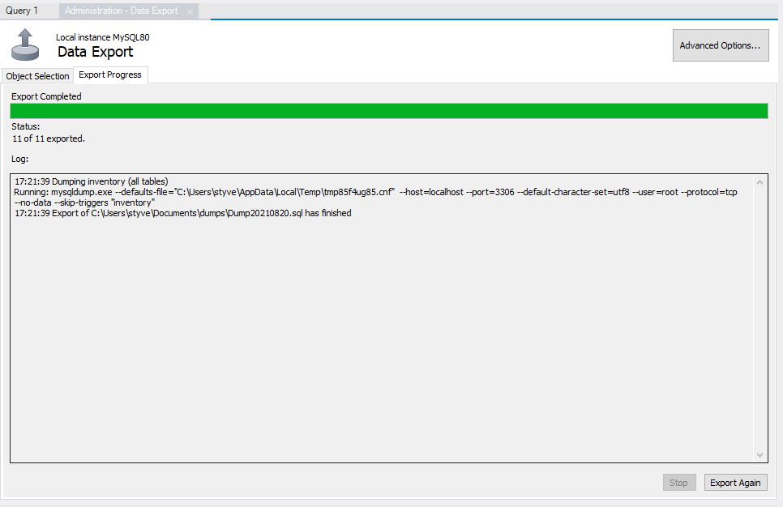

# Importación y exportación de datos

En este módulo se mostrará el procedimiento que se debe seguir para exportar e importar información en mysql.

## Requisitos

Tener instalado la herramienta Mysql Workbench

## Exportar datos

1. Abrir Workbench, dar click en la opcion server y seleccionar Data Export

2. En la ventana emergente seleccionamos la base de datos a exportar, el formato de exportación, ubicación y nombre del
   archivo y presionar el botón start

3. Una vez finalize el proceso de exportación de datos, la consola mostrará un mensaje de operación exitosa.

## Importar datos

1. abrir Workbench, dar click en la opción server y seleccionar Data Import.

2. En la ventana emergente seleccionamos el tipo de importación, la ubicación del archivo a importar y se selecciona el
   esquema en donde se va a importar la información y se procede a la importación haciendo click en el botón Start
   Import.

3. Una vez finalize el proceso de importación, la consola mostrará un mensaje de operación exitosa.
