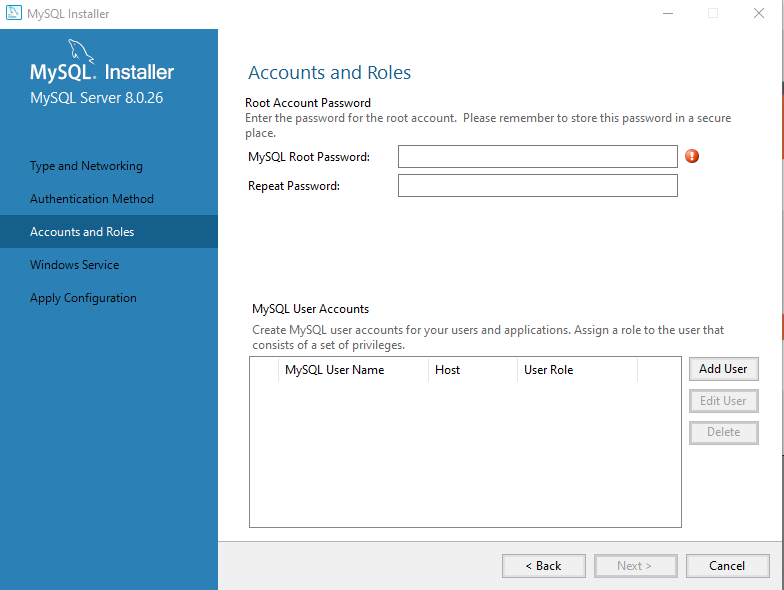

# Instalación de Mysql en Windows

En esta sección se mostrarán los pasos correspondientes con la correcta
instalación de Mysql en el sistema operativo windows.

## 2.1. Requerimientos tecnicos para la instalacion de Mysql

Para poder realizar la instalación y configuración de mysql en windows
(7, 8, 8.1 y 10) se debe cumplir con los
siguientes requisitos:

- Windows 7 o superior
- Microsoft .NET framework 4.5.2
- Un usuario con permisos de administrador para realizar la instalación y configuración.

En este manual estaremos trabajando con la version 8.x de Mysql y es posible que al momento de este leyendo este manual,
la version sea muy superior.

## 2.2. Descargar instalador

Para descargar el sistema de gestión de bases de datos mysql se debe ingresar a la pagina
de oficial [descargas](https://dev.mysql.com/downloads/windows/installer/).

## 2.3. Instalación

Abrir el instalador del sistema de gestión de bases de datos mysql para incializar la instalacion

1. Seleccionar el tipo de configuracion.

2. Descargar componentes de mysql

3. Verificar instalacion de componentes

4. Configuracion de red: podemos cambiar el puerto de mysql que por defecto es 3306

5. Configuracion de contraseña 

6. Aplicamos la configuracion

7. Finalmente podremos visualizar la consola de mysql

