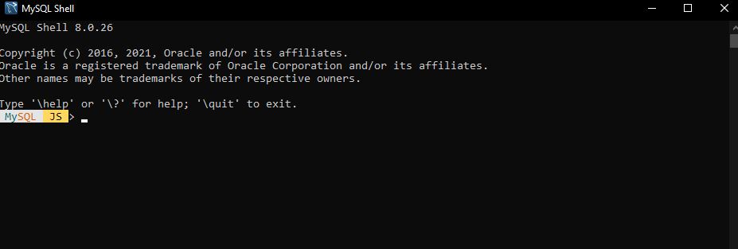

# Consola de mysql

La consola de Mysql es una potente herramienta que nos permite gestionar todos los aspectos de nuestras bases de datos
nuestras bases de datos mediante comandos.

La consola de Mysql trae una serie de comandos que son muy utiles para la gestion de bases de datos en servidores.

|Comando        |Alias      |Descripción                                                                                |
|---	        |---        |---	                                                                                    |
|\              |           |Inicia una entrada multi linea en el modo SQL                                              |
|\connect       |   (\c)    |Conecta la shell de Mysql server a la sesión global                                        |
|\disconnect    |   (\c)    |Desconecta la sesión global                                                                |
|\edit          |   (\e)    |Lanza el editor del sistema para editar el comando a ejecutar                              |
|\exit          |           |Cierra la Shell de mysql, es lo mismo que \quit                                            |
|\help          |  (\?,\h)  |Imprime información de ayuda acerca de un tema en especifico                               |
|\history       |           |Ver y editar el historico de la linea de comandos                                          |
|\history       |           |Ver y editar el historico de la linea de comandos                                          |
|\js            |           | Activa el modo de procesamiento de javascript                                             |
|\nopager       |           |Disables the current pager.                                                                |
|\nowarnings    |   (\w)    |    Don't show warnings after every statement.                                             |
|\option        |           |    Allows working with the available shell options.                                       |
|\pager         |   (\P)    | Sets the current pager.                                                                   |
|\py            |           |    Switches to Python processing mode.                                                    |
|\quit          |   (\q)    |  Exits the MySQL Shell.                                                                   |        
|\reconnect     |           | Reconnects the global session.                                                            |    
|\rehash        |           |    Refresh the autocompletion cache.                                                      |    
|\show          |           |  Executes the given report with provided options and  arguments.                          |
|\source        |   (\.)    |    Loads and executes a script from a file.                                               |     
|\sql           |           |    Executes SQL statement or switches to SQL processing mode when no statement is given.  |                                                   
|\status        |   (\s)    |    Print information about the current global session.                                    |                 
|\system        |   (\!)    |    Execute a system shell command.                                                        |
|\use           |   (\u)    |    Sets the active schema.                                                                |
|\warnings      |   (\W)    |    Show warnings after every statement.                                                   | 
|\watch         |           |    Executes the given report with provided options and arguments in a loop.               |
