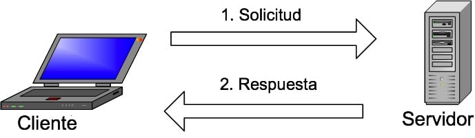

# Mysql

## Que es?

Una compañía sueca llamada MySQL AB originalmente desarrolló MySQL en 1994. La compañía de tecnología de los Estados
Unidos Sun Microsystems luego tomó el control por completo cuando compró MySQL AB en el 2008. El gigante de la
tecnología estadounidense Oracle adquirió Sun Microsystems en el 2010, y MySQL ha sido propiedad de Oracle desde
entonces.

En cuanto a la definición general, MySQL es un sistema de gestión de bases de datos relacionales de código abierto (
RDBMS, por sus siglas en inglés) con un modelo cliente-servidor. RDBMS es un software o servicio utilizado para crear y
administrar bases de datos basadas en un modelo relacional. Ahora, echemos un vistazo más de cerca a cada término:

Base de datos Una base de datos es simplemente una colección de datos estructurados.

La palabra «relacional» significa que los datos almacenados en el conjunto de datos son organizados en forma de tablas.
Cada tabla se relaciona de alguna manera. Si el software no es compatible con el modelo de datos relacionales,
simplemente se llama DBMS.

SQL MySQL y SQL no son lo mismo. MySQL es una de las marcas más populares de software RDBMS, que implementa un modelo
cliente-servidor. Entonces, ¿cómo se comunican el cliente y el servidor en un entorno RDBMS? Utilizan un lenguaje
específico del dominio: lenguaje de consulta estructurado (SQL, Structured Query Language). El software RDBMS a menudo
se escribe en otros lenguajes de programación, pero siempre usa SQL como lenguaje principal para interactuar con la base
de datos. MySQL como tal está escrito en C y C ++.

## ¿Cómo funciona?

La imagen explica la estructura básica cliente-servidor. Uno o más dispositivos (clientes) se conectan a un servidor a
través de una red específica. Cada cliente puede realizar una solicitud desde la interfaz gráfica de usuario (GUI) en
sus pantallas, y el servidor producirá el output deseado, siempre que ambas partes entiendan la instrucción.

Tomado de [Hostinguer](https://www.hostinger.co/tutoriales/que-es-mysql)
